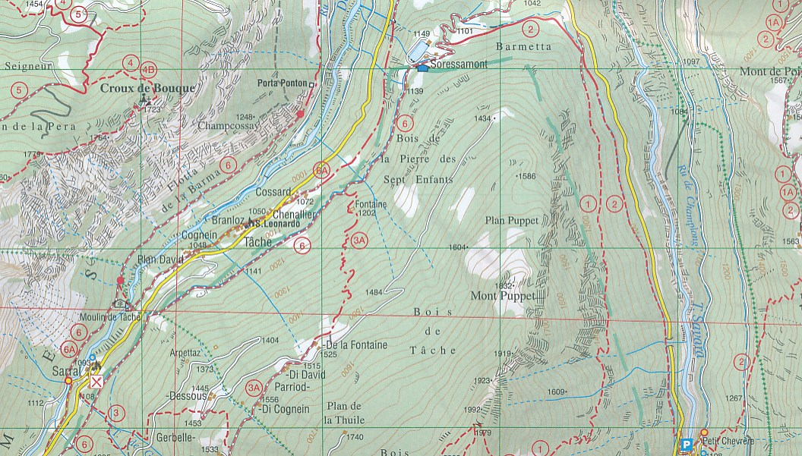

<figure>
    
    <figcaption><em>Fig 1. Wandelkaart 10 Valle di Cogne - Gran Paradiso | L'Escursionista editore (9788898520817)</em></figcaption>
</figure>

## Paklijst
 - Kaart
 - First aid kit
 - Via Ferrata gear
 - (Handschoentjes als we lame zijn)
 - Lippenbalsem / Vaseline
 - Goeie aanstekersk
 - Pincet
 - Contant geld voor hutten (kleine briefjes)

## Kooplijst
 - Hoofdlampje 1x
 - Waterproof bag (voor kleding)
 - ~~Menstruatie cup (Zoïe)~~
 - ~~Blarenpleisters~~
 - ~~Kleine zonnebrand~~
 - ~~Kleine tandpasta~~
 - ~~Trail run patta's (Zoïe)~~
 - ~~Ziplock bags (verschillende maten)~~
 - Hangfles voor water
 - Lucifers (nice)
 - ~~Lichgewicht handschoenen~~
 - Muts

## Zoeklijst
 - Hoofdlampje 1x
 - Camelbag (ouders)

## Eetlijst
 - Noten
 - Muesli bars
 - Havermout
 - Droge worst
 - Droge ham
 - Rozijnen
 - Gedroogd fruit
 - Koffie
 - Thee
 - Bouillon
 - Avondeten (check the blogs)
